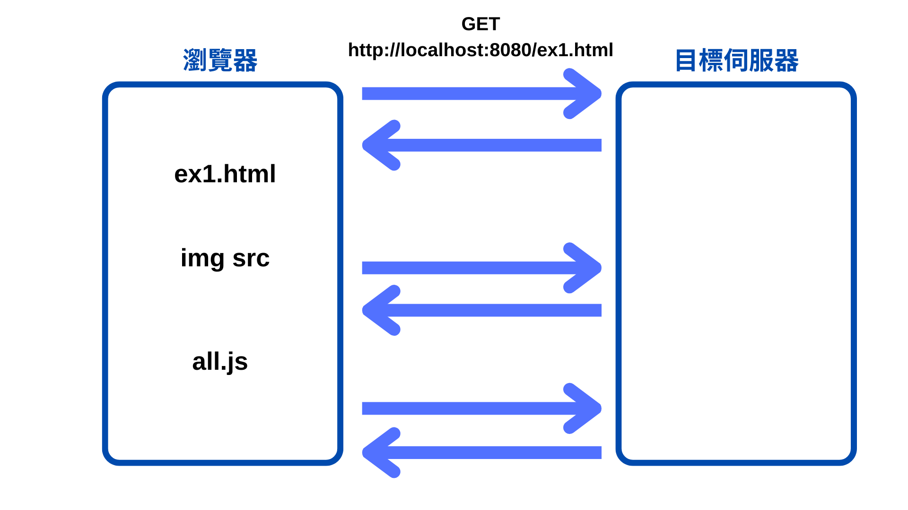

= AJAX 簡介與使用場景
:toc:

== AJAX 為何出現
在傳統的網頁應用中，每次進行頁面上的切換操作，例如切換新聞類別時，會造成以下情況：

1. **網址改變**：每次點擊新項目，瀏覽器都會跳轉到一個新的 URL。
2. **整個頁面重新載入**：右邊的廣告、表頭、新聞內容全部重新加載。
3. **表頭變動**：即使表頭不需要變化，也會隨著頁面的重新載入而被重新繪製。

這樣的情況會導致使用者在使用網站時感到繁瑣，並且等待時間長，體驗不好。這就是 AJAX 出現的原因。
``
=== AJAX 的好處

1. **不換頁面**：使用 AJAX 時，頁面不會重新加載，用戶操作更加流暢。
2. **只更新需要的資訊**：例如，當切換新聞分類時，僅更新新聞內容，旁邊的廣告和表頭不會變動。
3. **網址不變化**：即使更新了內容，頁面的 URL 也保持不變，這樣可以避免不必要的頁面跳轉。

== AJAX 網路請求

AJAX 是一種技術，允許在不重新加載整個頁面的情況下，通過 JavaScript 發出 HTTP 請求來取得資料。下面是 AJAX 網路請求的基本過程：

1. **發送請求**：
   - AJAX 可以發送一個 GET 請求到特定的網址，例如：`GET http://example.com/news`.
   - 當這個請求被發送後，瀏覽器會根據網址找到對應的 IP 和伺服器，伺服器會根據請求從資料庫中提取相應的資料。

2. **伺服器處理**：
   - 伺服器接收到請求後，根據請求的內容，從資料庫中取得需要的數據，然後將這些數據返回給瀏覽器。

3. **網路請求工具**：
   - 不僅是瀏覽器，其他軟體或程式碼（例如後端程式）也可以發出這樣的網路請求。
   - 在前端，我們可以使用 JavaScript 來實現這樣的網路請求，並使用瀏覽器開發工具 (`F12 -> Network` 標籤) 來查看所有的請求。

=== 示範：使用 AJAX 的網頁

製作一個簡單的網頁來展示 AJAX 網路請求的過程：

- 當用戶訪問 `index.html`，首先會發送一個請求來獲取 HTML 文件。
- 在解析 `index.html` 時，瀏覽器發現需要外部資源（例如圖片和 JavaScript 文件），所以接著會發送其他請求：
  - **第二個請求**：載入圖片資源。
  - **第三個請求**：載入 `all.js` 文件。

在 Network 標籤中，我們可以看到這些請求的順序和詳細資訊，了解瀏覽器如何處理每個資源。

[瀏覽器與伺服器之間的請求示意圖]
link:file:///C:/Users/USER/Desktop/%E5%A0%B1%E5%91%8A%E8%B3%87%E6%96%99%E5%A4%BE/ex1.html[開啟本地文件]