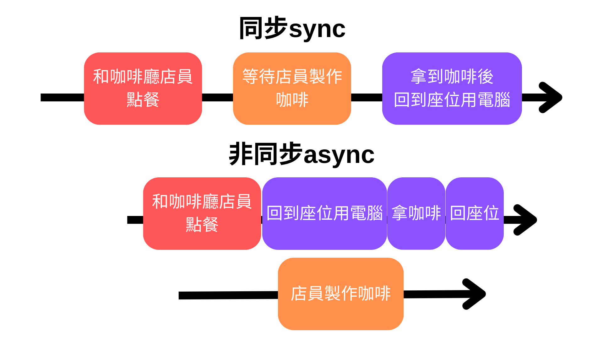
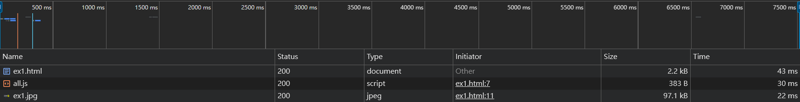
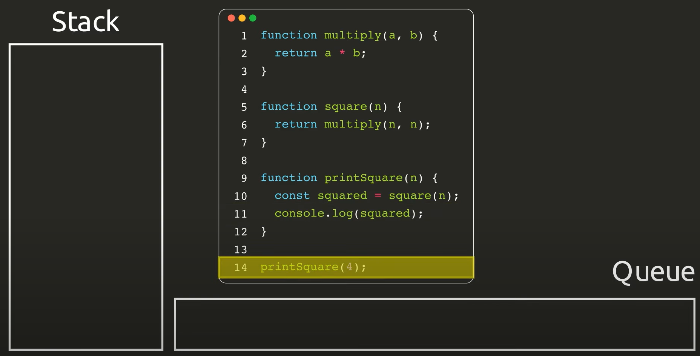
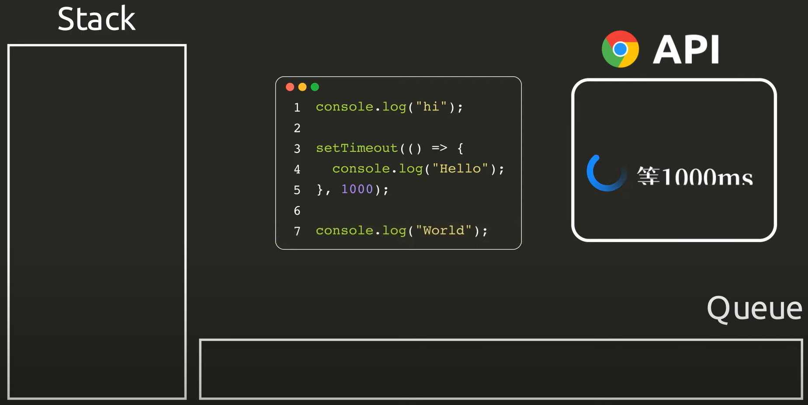
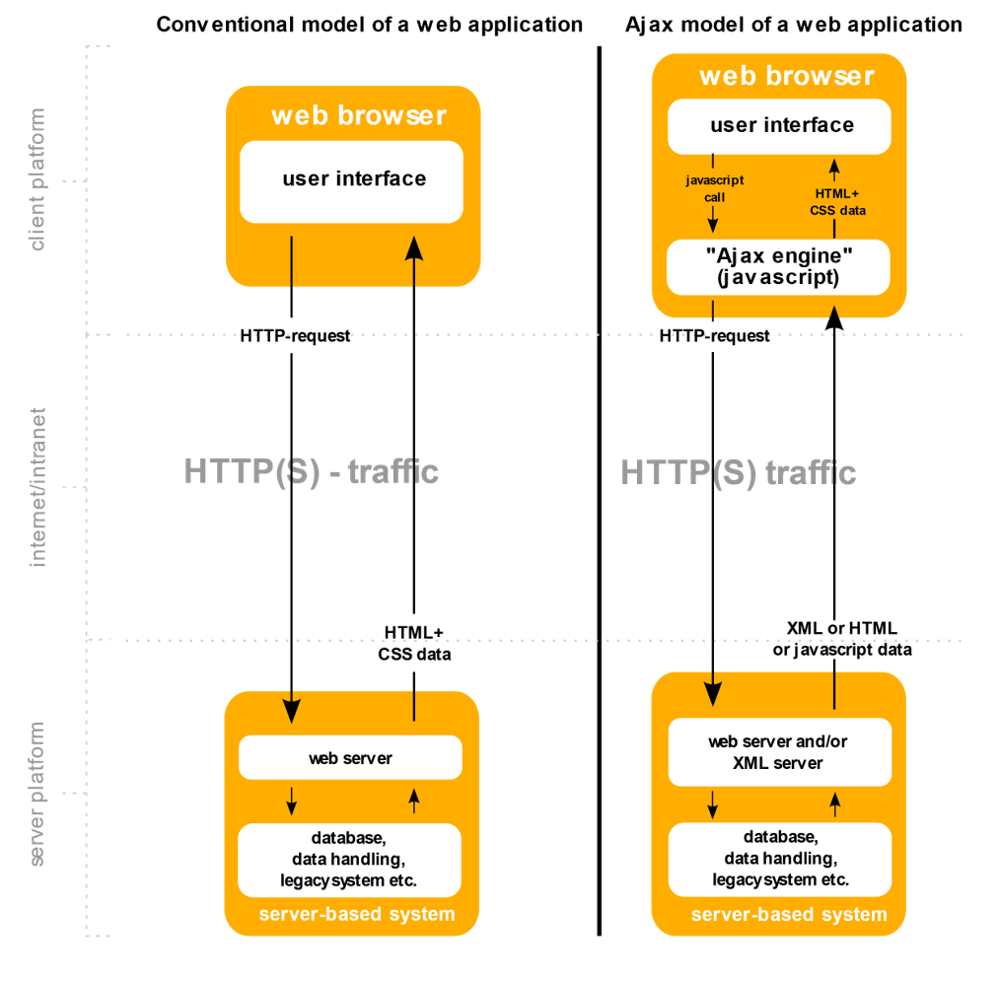
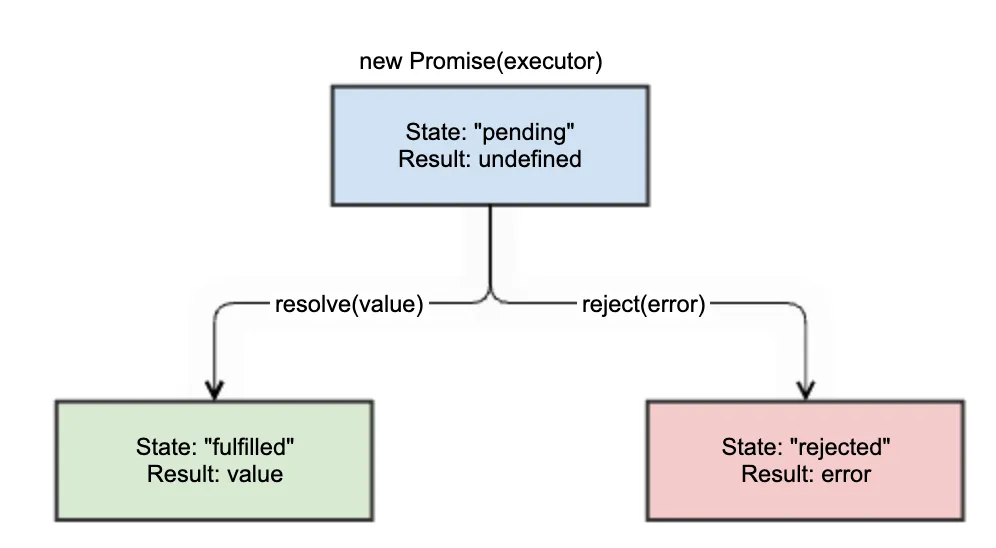

= JavaScript、函式、非同步

== 運算相關

=== Ternary Operator
是javaScript當中進行條件判斷的一種方法，運算子(?)前面為條件式，若條件式為真會執行運算子(:)前面的表達式，若為假則執行後面的表達式

==== 語法

[source, javascript]
----
條件式 ? 表達式1 : 表達式2
----

==== 簡單範例
[source, javascript]
----
var age = 26;
var beverage = age >= 18 ? "Beer" : "Juice";
console.log(beverage); // "Beer"
----

==== 可用來處理null
[source, javascript]
----
function greeting(person) {
    var name = person ? person.name : "stranger";
    return "Howdy, " + name;
}

console.log(greeting({ name: "Alice" })); // "Howdy, Alice"
console.log(greeting(null)); // "Howdy, stranger"
----
在上述的例子中若person為null則會被判為假值(Falsy)，因此會執行(:)後方的表達式

==== 條件鏈
三元運算子也可以使用類似if...else if...else的語法

[source, javascript]
----
let score = 85;

let grade = score >= 90 ? "A"
            : score >= 80 ? "B"
            : score >= 70 ? "C"
            : score >= 60 ? "D"
            : "F";

console.log(grade); // "B"
----

上述程式碼相當於下列if...else if...else

[source, javascript]
----
let score = 85;
let grade;

if (score >= 90) {
    grade = "A";
} else if (score >= 80) {
    grade = "B";
} else if (score >= 70) {
    grade = "C";
} else if (score >= 60) {
    grade = "D";
} else {
    grade = "F";
}

console.log(grade); // "B"
----

=== Nullish Coalescing Operator(??)/Assignment(??=)
javaScript 的 Nullish Coalescing Operator (??) 和 Nullish Coalescing Assignment (??=) 是用來處理 null 或 undefined 值的運算子，常用於提供默認值或簡化賦值操作。

==== (??)語法
[source, javascript]
----
let result = value1 ?? value2;
----
??運算子會檢查左側運算元是否為null或undefined，若為真會返回右側值，否則返回左側值

==== 簡單範例
[source, javascript]
----
let name = null;
let defaultName = "Anonymous";

let result = name ?? defaultName;
console.log(result); // 輸出Anonymous
----

==== (??=)語法
[source, javascript]
----
variable ??= value;
----
??= 運算子會檢查變數是否為null或undefined若為真則會進行賦值，否則會保持原樣

==== 簡單範例
[source, javascript]
----
let username = null;
username ??= "Guest";
console.log(username); // 輸出 Guest

let userAge = 0;
userAge ??= 18;
console.log(userAge); // 輸出 0
----

==== (??) 與 (||)

||是與??相似的運算子，皆會檢查左側運算元決定要返回的值，不同的是??只會檢查運算元是否為null或nudefined，而||則是檢查運算元是否為假值(Falsy)

==== 簡單範例
[source, javascript]
----
let value1 = 0;
let result1 = value1 ?? 10; // ??檢查null或undefined
let result2 = value1 || 10; // ||檢查Falsy

console.log(result1); // 輸出0
console.log(result2); // 輸出10
----

上述範例中由於??只會檢查null或undefined，因此輸出結果依然是1，而||會檢查Falsy，由於0是屬於Falsy，所以會賦予右側的值給result2，結果輸出就會是10

NOTE: ??與||同樣為短路運算子，因此??在判斷左側不為null或undefined時，就不會再執行右側的程式

=== Falsy
在 JavaScript 中，Falsy 值是指在布林值轉換時會被判定為 false 的值。當在需要布林值的地方（如條件判斷）使用這些值時，皆會被視為 false，其餘的則會轉成true(Truthy)

==== 會被視為Falsy的值
* false
* 0
* -0
* "" 或 ''(空字串)
* null
* undefined
* NaN

==== 簡單範例
[source, javascript]
----
if (!false) {
    console.log("false 是 Falsy 值");
}

if (!0) {
    console.log("0 是 Falsy 值");
}

if (!-0) {
    console.log("-0 是 Falsy 值");
}

if (!"") {
    console.log("空字串 是 Falsy 值");
}

if (!'') {
    console.log("空字串 是 Falsy 值");
}

if (!null) {
    console.log("null是 Falsy 值");
}

if (!undefined) {
    console.log("undefined 是 Falsy 值");
}

if (!NaN) {
    console.log("NaN是 Falsy 值");
}
----

因此在javaScript的條件判斷中就算不放條件式程式也可以正常執行，因為javaScript會自己判斷內容是Truthy或Falsy，並且轉換成true或false

[source, javascript]
----
if(1) {
    console.log("Truthy")
} else {
    console.log("Falsy")
}

if("abc") {
    console.log("Truthy")
} else {
    console.log("Falsy")
}

if(0) {
    console.log("Truthy")
} else {
    console.log("Falsy")
}
----

==== 一些簡單應用

* 可用來判斷輸入名稱是否為空字串
[source, javascript]
----
let falsyName = "";
if (!falsyName) {
    console.log("名稱不可為空");
}
----

* 若輸入為空可提供預設值
[source, javascript]
----
let falsyUserName = "";
let falsyDisplayName = falsyUserName || "訪客"; 
console.log(falsyDisplayName); // "訪客"
----

* 配合三元運算子判斷年齡驗證
[source, javascript]
----
let falsyAge = 0;
let falsyStatus = falsyAge ? "有效年齡" : "無效年齡";
console.log(falsyStatus); // "無效年齡"
----

* 驗證API資料是否正確獲取
[source, javascript]
----
let apiResponse = null;

if (!apiResponse) {
    console.log("無法獲取資料");
} else {
    console.log("資料已獲取");
}
----

=== Custom Error
在javaScript中可藉由繼承Error類擴充一個自訂義的錯誤類型，透過創建具有特定意圖或語義的錯誤來更精確地處理錯誤情況

==== 創建Custom Error
1. 創建一個新的類，該類繼承自Error，並且添加自定義的屬性或方法來進一步擴展其功能
2. 為了確保錯誤信息正確顯示，需要調用 Error建構子，並且手動設置堆疊追蹤。

[source, javascript]
----
class MyCustomError extends Error {
    constructor(message) {
    // 調用父類 (Error) 的建構子，傳遞錯誤信息
        super(message);
        this.name = 'MyCustomError'; // 設置錯誤名稱為自定義的類名
    }
}

try {
    throw new MyCustomError('This is a custom error message!');
} catch (err) {
    console.log(err.name); // MyCustomError
    console.log(err.message); // This is a custom error message!
    console.log(err.stack); // 錯誤堆疊追蹤
}
----

==== 一些應用例子
- 數據驗證錯誤
[source, javascript]
----
class ValidationError extends Error {
    constructor(message, field) {
        super(message);
        this.name = 'ValidationError';
        this.date = new Date();
        this.field = field; // 追蹤是哪個字段導致的錯誤
    }
}

function validateUser(user) {
    if (!user.name) {
        throw new ValidationError('Name is required', 'name');
    }
    if (user.age < 18) {
        throw new ValidationError('User must be at least 18 years old', 'age');
    }
}

try {
    const user = { name: '', age: 16 };
    validateUser(user);
} catch (err) {
    console.log(err.date)
    console.log(`${err.message} in ${err.field} field`);
    console.log(err.stack)
}
----

* 登入認證錯誤
[source, javascript]
----
class AuthenticationError extends Error {
    constructor(message, reason) {
        super(message);
        this.name = 'AuthenticationError';
        this.date = new Date();
        this.reason = reason; // 指出具體的認證問題
    }
}

function login(username, password) {
    const storedPassword = 'password123'; // 假設這是從資料庫獲取的密碼
    if (password !== storedPassword) {
        throw new AuthenticationError('Invalid password', 'incorrect_password');
    }
    return 'User authenticated successfully';
}

try {
    login('user1', 'wrongpassword');
} catch (err) {
    console.log(err.date)
    console.log(`Authentication failed: ${err.message} (${err.reason})`);
    console.log(err.stack)
}
----

* 檔案文件讀取錯誤
[source, javascript]
----
class FileReadError extends Error {
    constructor(message, fileName) {
        super(message);
        this.name = 'FileReadError';
        this.date = new Date();
        this.fileName = fileName; // 保存出錯的文件名
    }
}

function readFile(fileName) {
    const success = false; // 假設文件讀取失敗
    if (!success) {
        throw new FileReadError(`Failed to read file: ${fileName}`);
    }
    return 'File content';
}

try {
    readFile('data.txt');
} catch (err) {
    console.log(err.date)
    console.log(`File error: ${err.message} (File: ${err.fileName})`);
    console.log(err.stack)
}
----

==== 深層繼承

Custom Error也可以使用深層繼承達到不同領域的錯誤類別

[source,javascript]
----
class ApplicationError extends Error { // 通用的應用程式錯誤類別
    constructor(message) {
        super(message);
        this.name = 'ApplicationError';
        this.date = new Date();
    }
}

class ValidationError extends ApplicationError { // 數據驗證錯誤
    constructor(message, field) {
        super(message);
        this.name = 'ValidationError';
        this.field = field; // 追蹤是哪個字段導致的錯誤
    }
}

class AuthenticationError extends ApplicationError { // 登入驗證錯誤
    constructor(message, reason) {
        super(message);
        this.name = 'AuthenticationError';
        this.reason = reason; // 指出具體的認證問題
    }
}

class FileReadError extends ApplicationError { // 檔案文件讀取錯誤
    constructor(message, fileName) {
        super(message);
        this.name = 'FileReadError';
        this.fileName = fileName; // 保存出錯的文件名
    }
}
----

== 變數與作用域

=== var / let / const 差異
在JavaScript，有三種變數宣告的方式: var, let, const，其中ES6後新增了let, const，他們與原先的var最主要的差別在於:

.區塊作用域 (Block-Level Scope)
- let

- const

.函式作用域 (Function-Level Scope)
- var

=== let / const 的宣告使用
簡單說，let用於宣告變數，const用於宣告常數

[source, javascript]
----
{
    let dessert1 = "cookie";
    dessert1 = "cake";
    console.log(dessert1); // cake
    
    const dessert2 = "cookie";
    dessert2 = "cake"; //TypeError: Assignment to constant variable. 
    console.log(dessert2);
}
----

[source, javascript]
----
{
    const dessert8; //SyntaxError
    dessert8 = "cake";  
    console.log(dessert8);
}
----

由以上範例可知，由let宣告的變數值是可以改變的，而由const宣告的常數則反之，且需要在宣告初始就賦值。但其實const還是有例外:

[source, javascript]
----
{
    const cake = {
        fruit: "apple"
    }
    cake.fruit = "cherry";
    console.log(cake.fruit); // cherry
}
----
咦? 為什麼使用物件與array，值就可以改?

其實變數底層的運作的方式，不可改的是變數儲存的記憶體位置，改陣列與物件的內容卻是可以的。

 
=== 區塊作用域 (Block-Level Scope)

下面讓我們看看block的特性:

[source, javascript]
----
{
    let dessert3 = "cookie";
    console.log(dessert3); // cookie
}
console.log(dessert3); //ReferenceError: dessert3 is not defined
----

可以看出let的作用域(Scope) 僅限於大括號內(block)，同理if、for迴圈、while迴圈也適用

[source, javascript]
----
for(let i=1 ; i<=5 ; i++){
    console.log(i); // 1 2 3 4 5
}
console.log(i); //ReferenceError: i is not defined
----

=== 函式作用域 (Function-Level Scope)
var不同於前者，他的Scope並不僅只限於Block內

[source, javascript]
----
{
    var dessert4 = "cake";
    console.log(dessert4); // cake
}
console.log(dessert4); // cake
----

[source, javascript]
----
for(var varLoop=1 ; varLoop <= 5 ; varLoop++){
    console.log(varLoop); // 1 2 3 4 5
}
console.log(varLoop); // 6
----

難道用var宣告就只能是全域變數嗎? 不不不，想讓他變成區域變數只需要包在函式(function)裡面即可:

[source, javascript]
----
function printDessert5() {
  var myDessert5 = "Pie";
  console.log(myDessert5); // Pie
}
printDessert5(); 
console.log(myDessert5); // ReferenceError: myDessert5 is not defined
----

=== var 的宣告使用
相較於let/const，var存在一個允許重複宣告的特性:

[source, javascript]
----
{
    var dessert6 = "cookie";
    var dessert6 = "candy";
    console.log(dessert6); // candy
}
----
但 let / const 無法重複宣告:

[source, javascript]
----
{
    let dessert7 = "cookie";
    let dessert7 = "candy"; //SyntaxError: Identifier 'dessert7' has already been declared
    console.log(dessert7);
}
----

=== Hoisting
較直觀的宣告邏輯大概都是先宣告才能使用，但因為Hoisting的特性卻能先使用再宣告

[source, javascript]
----
{
    function printDessert() {
        myDessert = "Pie";
        console.log(myDessert); // Pie
        
        var myDessert;
    }
    
    printDessert();
}
----

甚至將宣告放在程式不會被執行的地方也可以:

[source, javascript]
----
{
    function printDessert2() {
        myDessert2 = "Pie";
        console.log(myDessert2); // Pie
        
        while(false){
            console.log("這裡不會被執行");
            var myDessert2; // 在這裡宣告也可以
        }
    }
    
    printDessert2(); // Pie
}
----

上面例子之所以能正常運行，是因為對於JavaScript，無論你在函數中的哪一行用 var 宣告變數，一律視為在函數的第一行宣告，這也是為什麼第二例子的宣告還是合法的，而此正是hoisting(抬升)

那再看看下面的例子:

[source, javascript]
----
{
    function printDessert3() {
        console.log(myDessert3); // undefined
        var myDessert3 = "Pie";
        console.log(myDessert3); // Pie
    }
    
    printDessert3();
}
----

由上述可以看到，被hoisting上去的其實只有" var myDessert; "，賦值(把值指派給變數) 的動作不會 hoisting。

=== 函式的Hoisting
其實函式也是能Hoisting的(先使用再宣告):

[source, javascript]
----
{
    printDessert4();
    
    function printDessert4() {
        var myDessert4 = "Pie";
        console.log(myDessert4); // Pie
    }
    
}
----

看來對於JavaScript，函式的宣告也都會先被提升到最前面
再來看看一個有趣的例子:

[source, javascript]
----
{
    function isEven(n) {
      if (n === 0) return true;
      return isOdd(n - 1);
    }

    function isOdd(n) {
      if (n === 0) return false;
      return isEven(n - 1);
    }

    console.log(isEven(4)); //true

}
----

這個特性可以解決一個問題，也就是兩個函數需要互相呼叫彼此的狀態，也就是 A() 裡面會呼叫到 B()，而 B() 裡面會呼叫的 A() 的遞迴狀況(Cycling Recursion)。

=== Temporal Dead Zone, TDZ
在JavaScript中，當我們使用 let 或 const 宣告某個變數或常數時，在該變數或常數還沒有被賦予值之前會產生一段它們不能被使用的狀況，這段時間就是所謂的 *暫時性死區* (Temporal Dead Zone)的情況。

==== 為什麼有TDZ
在 ES6 中引入了 let 和 const，它們不同於 var，因為 var 變數會被提升，但它們的值會在定義之前就可以被訪問，而這通常會導致不可預測的錯誤。為了解決這個問題，JavaScript 引入了 TDZ 概念來限制 let 和 const 變數在初始化之前的使用，從而提高代碼的安全性和可讀性。

[source, javascript]
----
{
    console.log(myDessert5); // undefined
    var myDessert5 = "muffin";
    console.log(myDessert5); // muffin
}
----

==== TDZ的行為
當一個變數使用 let 或 const 宣告時，它在作用域的最頂部被"標記"為已存在，但不會被初始化。只有當執行到宣告語句時，變數才會被初始化。在變數初始化之前，它位於 TDZ 中，不能被訪問。

[source, javascript]
----
{
    //let myDessert6; // 實際這行會被Hoist上來
    console.log(myDessert6); //ReferenceError: myDessert6 is not defined
        
    let myDessert6 = "pie";
    
}
----

[source, javascript]
----
{
    if(true){
        //TDZ 起始點(top of block)
        console.log(myDessert7); ////ReferenceError: myDessert7 is not defined
        let myDessert7;
        //TDZ 結束(賦值之前)
        myDessert7 = "pie";
        
        console.log(myDessert7); // pie
    }
}
----

==== TDZ小結
- TDZ 是指在變數被宣告和初始化之間的時間段，這段時間內變數不可訪問。
- TDZ 只與 let 和 const 宣告相關。
- 在 TDZ 期間訪問變數會拋出 ReferenceError 錯誤。
- var 不受 TDZ 限制，因為它會被提升並初始化為 undefined。

==== 總結

[cols="1,1,1,1", options="header"]
|===
| 特性                        | `var`                        | `let`                          | `const`

| **作用域（Scope）**          | 函數作用域    | 區塊作用域        | 區塊作用域 
| **變數提升（Hoisting）**     | 是，提升至作用域頂部，初始值為 `undefined` | 是，提升但未初始化，位於暫時性死區 (TDZ) | 是，提升但未初始化，位於 TDZ
| **可重新賦值（Reassignment）**| 可以重新賦值                  | 可以重新賦值                    | 不可重新賦值
| **必須在宣告時賦值**         | 否                           | 否                              | 是
| **全域物件屬性**             | 是 | 否                              | 否
| **暫時性死區（TDZ）**        | 否                           | 是                              | 是
| **初始值**                   | `undefined` （若沒有賦值）   | 不可使用未初始化的變數 (TDZ)     | 必須在宣告時賦值，否則報錯
|===

== 非同步

=== 同步/非同步差異
==== 舉例生活化的例子

* **同步（在原地等待）**：就像你在咖啡廳點餐後，**在原地等待店員**做完咖啡，拿到咖啡後才做下一件事情。
所以同步的特性：**必須等待當前的任務完成，才做下一件事情**。

* **非同步（先回座位處理事情）**：你在咖啡廳點完餐後，**回到座位**，打開電腦處理其他事情，等到**店員叫號**的時候再去拿咖啡。
所以非同步的特性：**在等待某個任務的完成期間，可以處理其他任務**。

==== 在瀏覽器中的同步載入

* link:example/ex1.html[簡單HTML的例子(同步)]
* link:example/ex1-1.html[簡單HTML的例子(非同步)]

[source,html]
----
<!DOCTYPE html>
<html lang="en">
<head>
    <meta charset="UTF-8">
    <meta name="viewport" content="width=device-width, initial-scale=1.0">
    <link rel="icon" href="ex1.jpg" type="icon">
    <title>Example1</title>
</head>
<body>
    <h1>範例1</h1>
    <!--為了明顯差異才放這-->
    
    
</body>
</html>
----
* 這個範例想說明
  . 瀏覽器會請求整個HTML文件，並逐行解析。在解析的過程中，如果遇到圖片或CSS等外部資源時，瀏覽器會發出請求來載入這些資源，並同時繼續解析其餘的HTML。
  . 當遇到JavaScript檔案時，如果沒有使用 `async` 或 `defer` 屬性，瀏覽器會暫停解析HTML，直到JavaScript載入並執行完成，才會繼續解析剩餘的HTML。因此，當JavaScript需要執行時間較久，可能會造成阻塞(Blocking)，導致使用者感覺頁面卡住。

- link:https://developer.mozilla.org/zh-CN/docs/Glossary/Parse[參考資料1]
link:https://html.spec.whatwg.org/multipage/images.html#attributes-common-to-source-and-img-elements[參考資料2]

==== Event Loop、CallBack與非同步的關係
* **JavaScript 是單執行緒**，因此想要達成非同步操作，就需要依賴執行環境提供的機制

* JavaScript 本身並沒有事件循環（Event Loop）這個機制，是由 JavaScript 的執行環境所提供的

* 當遇到非同步操作時，callback 函式在 **Event Loop 管理下**，會被丟到外面，等同步操作完成後，Event Loop 再從 Queue 中取出 callback 函式執行。

===== 以 setTimeout() 函式例子來解釋

* 一般情況下，同步的程式碼會到 Call Stack（後進先出）內逐一執行。

* 上面會發生：

1. 呼叫 `printSquare(4)`
   - `printSquare` 函數被加入 `Call Stack`。

2. `printSquare` 內部呼叫 `square(n)`
   - `square` 函數也被加入 `Call Stack`。

3. `square(n)` 內部呼叫 `multiply(n, n)`
   - `multiply` 函數被加入 `Call Stack`。

4. `multiply(n, n)` 計算完成並 `return`
   - `multiply` 從 `Call Stack` 中移除。

5. `square(n)` 執行完畢並 `return`
   - `square` 從 `Call Stack` 中移除。

6. 回到 `printSquare` 函數，`printSquare` 執行完成後
   - `printSquare` 從 `Call Stack` 中移除。

* 當執行 setTimeout() 函式時，setTimeout 會短暫進入 Call Stack 設定計時器，並將 callback 函式交給 Web API 進行計時。等計時時間到後，callback 函式會進入 Queue 排隊，當 Stack 內同步操作都完成且為空時，Event Loop 會將它取出來執行。

* 上面會發生:
1. 印出 `hi`
   - `console.log('hi')` 被加入 `Call Stack`，並立即執行。

2. 遇到 `setTimeout()` 函式
   - `setTimeout()` 進入 `Call Stack`，並設定計時器。
   - 計時器被丟到瀏覽器的 `Web API`，開始計時。

3. `setTimeout()` 完成設定
   - `setTimeout()` 從 `Call Stack` 中移除。

4. 繼續執行同步代碼
   - 印出 `World`，`console.log('World')` 被加入 `Call Stack`，並立即執行後移除。

5. 計時器完成計時後
   - `setTimeout()` 的 `callback` 函式被放入 `Queue` 等待。

6. `Call Stack` 清空後
   - `Event Loop` 檢查 `Queue`，將 `callback` 推入 `Call Stack` 中執行。

===== Queue 又細分為 Microtask（微任務）、Macrotask（宏任務）

* macrotask（就是 task）是指比較大型且需要等待的非同步操作。常見的 macrotask 包括：
    - 從 `
----

* 這段代碼中，使用了 fetch() 來發送 HTTP 請求到 `https://jsonplaceholder.typicode.com/posts/${postId}`，請求數據並通過 `.then(response => response.json())`` 將回應轉換為 JSON 格式的數據。

* `.then(data => { ... })` 接收轉換後的數據，用這些數據來覆蓋原本的 HTML 內容。

* `document.getElementById('content').innerHTML`更改 content 這個 
 元素的內容，將其覆蓋為新的 <h3> 和 
 元素。

==== AJAX 的實現方式

===== 最原始的方式

* **XMLHttpRequest**： +
需要手動處理請求的建立 (open 方法)、發送 (send 方法)、以及如何處理回應 (onload 事件)。
  
[source,javascript]
----
const xhr = new XMLHttpRequest();
xhr.open('GET', 'https://jsonplaceholder.typicode.com/posts/1');
xhr.onload = function() {
    if (xhr.status === 200) {
        console.log(JSON.parse(xhr.responseText)); // 請求成功，解析並顯示資料
    } else {
        console.error('Request failed.'); // 請求失敗
    }
};
xhr.send();
----

* **Fetch API**： +
比較現代的方式，使用 Promise 來進行非同步操作。比  `XMLHttpRequest` 更加簡潔。

[source,javascript]
----
fetch('https://jsonplaceholder.typicode.com/posts/1')
    .then(response => response.json()) // 解析為 JSON 格式
    .then(data => console.log(data)) // 成功時顯示資料
    .catch(error => console.error('Error:', error)); // 處理錯誤
----

===== 工具與框架

* **Axios**： +
  基於 **Promise** 的 HTTP 客戶端，在 `Fetch API` 的基礎上進一步封裝，提供了一些更方便的功能，例如錯誤處理、請求取消等。

[source, javascript]
----
axios.get('https://jsonplaceholder.typicode.com/posts/1')
    .then(response => console.log(response.data)) // 直接取出資料
    .catch(error => console.error('Error:', error));
----

* **jQuery 的 $.ajax()**： +
  是 jQuery 中的 AJAX 方法，早期廣泛使用，但現在主要出現在一些老項目。

[source, javascript]
----
$.ajax({
    url: 'https://jsonplaceholder.typicode.com/posts/1',
    method: 'GET',
    success: function(data) {
        console.log(data);
    },
    error: function(error) {
        console.error('Error:', error);
    }
});
----

==== 總結

* Ajax是一套綜合性瀏覽器端技術，結合多種前端技術，透過非同步請求來提升使用者體驗。

|===
| 技術          | 描述

| HTML/CSS
| 定義網頁的結構和樣式，使網頁具有良好的外觀和版面

| JavaScript
| 控制頁面的動態行為，操作 DOM，實現非同步資料互動

| XMLHttpRequest 或 Fetch API
| 與伺服器進行非同步通訊，實現資料的部分更新

| JSON/XML
| 瀏覽器和伺服器之間的資料格式
|===

* 實現方式有下面幾種
|===
| 實現方式        | 說明

| XMLHttpRequest  | 最早期的 AJAX 實現方式，手動處理請求的建立、發送及回應。
| Fetch API       | 現代化的替代方案，語法簡潔，基於 Promise 進行非同步操作。
| Axios           | 基於 Promise 的 HTTP 客戶端，封裝底層請求，提供更友善的語法及更多功能（如錯誤處理、取消請求等）。
| jQuery 的 $.ajax() | 早期廣泛使用的 AJAX 方法，現在主要用於一些舊有項目中。
|===

* link:https://www.keycdn.com/support/ajax-programming[參考資料7 - What Is Ajax Programming - Explained]
* link:https://codedocs.org/what-is/ajax-programming[參考資料8 - Ajax (programming)]

=== XMLHttpRequest/fetch
XMLHttpRequest（簡稱 XHR）是一種在網頁中與伺服器進行資料交換的 API，允許在不重新載入整個頁面的情況下，動態地更新部分網頁內容。這使得網頁應用程式在更新部分資料時不會去中斷使用者當下的操作。

* 特色

** XHR基於事件，它通過監聽和處理不同的事件來管理請求的生命周期。這些事件主要依賴於回調函數（事件監聽器）來處理非同步操作的結果。

** XHR 可以在後台發送請求，並在伺服器回應時處理資料，而不會阻塞用戶界面的操作。

** 此項技術在所謂的「AJAX」（Asynchronous JavaScript and XML）功能應用中被大量使用。

** XMLHttpRequest 可用來接收任何類型的資料，不限於 XML 類型。

* 實作XMLHttpRequest

** 步驟如下
    . 建立xhr物件
    . 設定請求
    . 傳送請求
    . 監聽回應
    . 處理資料

.程式碼範例
[source, javascript]
----
// 創建一個新的 XMLHttpRequest 物件
var xhr = new XMLHttpRequest();

// 定義當接收到回應時的回調函數
function reqListener() {
    if (xhr.readyState === XMLHttpRequest.DONE) { // 請求完成
        if (xhr.status === 200) { // 請求成功
            // 處理伺服器回應的資料
            console.log(xhr.responseText);
        } else { // 請求失敗
            console.error('請求失敗，狀態碼：' + xhr.status);
        }
    }
};

//將函數括載到load上
xhr.onload = reqListener

// 初始化一個 GET 請求 各項參數分別為：請求方法、URL、是否為非同步執行
xhr.open('GET', 'https://httpbin.org/get', true);

// 發送請求
xhr.send(null);
----

==== Fetch

JavaScript 的 fetch API 是一個由 WHATWG Fetch Standard 所定義的**能獲取跨網路資源的介面**，用於在網頁中進行網路請求。

.Fetch的介面的核心
[cols="1,3"]
|===
| 項目 | 說明

| **Request**
| Request 物件用於封裝網絡請求的各個部分，包括 URL、請求方法（如 GET、POST）、標頭（Headers）以及請求的內容（Body）。

| **Response**
| Response 物件代表伺服器回應的內容，包括 HTTP 狀態碼（如 200、404）、標頭（Headers）以及回傳的資料（Body）。可以通過不同的方法來解析回應內容，例如 .json() 解析為 JSON 格式，.text() 解析為純文字等。

| **Header**
| 用於操作 HTTP 標頭，提供方法如 get()、set()、append() 等來讀取和修改標頭。

| **Body**
|Body 介面是 Request 和 Response 的基礎，提供多種方法來處理請求和回應的內容。常用的方法包括 .json() 將回應解析為 JSON，.text() 解析為文字，.blob() 解析為二進制大對象（Blob）等。
|===

* 要呼叫fetch()方法只要在 Global環境下可直接呼叫fetch方法即可

.如何使用fetch取得資源
[source, javascript]
----

const request = new Request("https://httpbin.org/get", {
  method: 'GET',
  headers: {
    'Content-Type': 'application/json'
  }
});

//fetch的第一個參數為URL，此參數為必填
fetch(request) //只有url就會預設這個請求的HTTP請求方法是GET。
  .then(response => {// 接收到伺服器丟回來的response
    return response.json();
  })
  .then(function (myJson) {
    console.log(myJson);
  }).catch(error => {
    console.error('Fetch error:', error);
  });
----

Fetch()基於Promise，允許開發者以更清晰和簡潔的方式處理非同步操作。但需要注意的是fetch() 回傳的 promise 物件只會在網路中斷或著其他導致Request中斷的狀況下才會出現rejected狀態。這也就是說，只要伺服器有回傳，它的回傳就都會是fulfilled狀態。

==== 直接使用XMLHttpRequest物件的問題與使用fetch的對比

* XMLHttpRequest的API設計得過於高階(簡單)，所有的輸出與輸入、狀態，都只能與這個XHR物件溝通取得。

假設你需要自訂請求的一些細節，如自定義請求的標頭或處理不同的回應類型，XHR 的封裝性會使這些操作變得繁瑣。
並且XHR的**錯誤處理**也被封裝起來，要捕捉到網路錯誤或超時等異常情况十分困難。

.使用XMLHttpRequest
[source, javascript]
----
const xhr2 = new XMLHttpRequest();
xhr2.open('POST', 'https://httpbin.org/post', true);
xhr2.setRequestHeader('Content-Type', 'application/json;charset=UTF-8');
xhr2.onreadystatechange = function() {
  if (xhr2.readyState === XMLHttpRequest.DONE) {
    if (xhr2.status === 200) {
      const response = JSON.parse(xhr2.responseText);
      console.log(response);
    } else {
      console.error('請求失敗');
    }
  }
};
xhr2.onerror = function() {
  new Error('網路錯誤'); // 無法得知更詳細的錯誤訊息 只知道是網路錯誤
};
const data = JSON.stringify({ key: 'value' });
xhr2.send(data);

----

.使用fetch
[source, javascript]
----
fetch('https://httpbin.org/post', {
  method: 'POST',
  headers: {
    'Content-Type': 'application/json;charset=UTF-8'
  },
  body: JSON.stringify({ key: 'value' })
})
.then(response => {
  if (!response.ok) {
    throw new Error('請求失敗');
  }
  return response.json();
})
.then(data => console.log(data))
.catch(error => console.error(error));//可以取得詳細的錯誤資訊

----

* 回調地獄

XHR的使用皆**基於回調函數**，假設我要取得某位使用者的貼文與他的貼文評論時，用XHR寫起來會是像在打波動拳。

不囉說,直接上圖
[source, javascript]
----
function getData(url, callback) {
    var xhr = new XMLHttpRequest();
    xhr.open('GET', url);
    xhr.onload = function () {
        if (xhr.status === 200) {
            try {
                var data = JSON.parse(xhr.responseText);
                callback(null, data);
            } catch (e) {
                callback(new Error('解析 JSON 失敗'));
            }
        } else {
            callback(new Error('請求失敗，狀態碼: ' + xhr.status));
        }
    };
    xhr.onerror = function () {
        callback(new Error('網路錯誤'));
    };
    xhr.send();
}
// 使用回調波動拳
getData('https://jsonplaceholder.typicode.com/users/1', function (err, user) {
    if (err) {
        console.error('獲取使用者資料時出現錯誤:', err);
    } else {
        console.log('使用者資料:', user);
        getData('https://jsonplaceholder.typicode.com/posts?userId=' + user.id, function (err, posts) {
            if (err) {
                console.error('獲取使用者的貼文時出現錯誤:', err);
            } else {
                console.log('使用者的貼文:', posts);
                if (posts.length === 0) {
                    console.log('此使用者沒有任何貼文。');
                    return;
                }
                var firstPostId = posts[0].id;
                getData('https://jsonplaceholder.typicode.com/comments?postId=' + firstPostId, function (err, comments) {
                    if (err) {
                        console.error('獲取貼文的評論時出現錯誤:', err);
                    } else {
                        console.log('貼文的評論:', comments);
                    }
                });
            }
        });
    }
});
----

使用fetch進行請求的話看起來不會那麼凌亂，並且因為基於Promise，可以使用tryCatch進行錯誤處理。

[source, javascript]
----
// 定義一個使用 fetch 的 getData 函數
async function getData(url) {
    const response = await fetch(url);
    if (!response.ok) {
        throw new Error('請求失敗，狀態碼: ' + response.status);
    }
    return response.json();  // 直接返回解析後的 JSON 數據
}

// 使用 async/await 進行非同步操作
async function fetchUserData() {
    try {
        const user = await getData('https://jsonplaceholder.typicode.com/users/1');
        console.log('使用者資料:', user);

        const posts = await getData('https://jsonplaceholder.typicode.com/posts?userId=' + user.id);
        console.log('使用者的貼文:', posts);

        if (posts.length === 0) {
            console.log('此使用者沒有任何貼文。');
            return;
        }

        const comments = await getData('https://jsonplaceholder.typicode.com/comments?postId=' + posts[0].id);
        console.log('貼文的評論:', comments);
    } catch (err) {
        console.error('發生錯誤:', err);
    }
}

// 執行非同步函數
fetchUserData();
----

=== try…​catch 與非同步
:toc: macro

==== **語法**

try catch 可以處理同步的程式碼。
try區塊後需要有catch 或 finally。

[source,javascript]
----
try{
    //block
}catch(e){ //這裏的e是block區塊中被丟出的任意物件(通常是xxError)
 
}finally{
//一定會執行的區塊
}
----

==== **try catch 與非同步**

try catch 可以處理同步的程式碼，以下有數種可以處理非同步程式的錯誤的方式

1.前面有加上await的函式

[source,javascript]
----
async function awaitrun() {
    console.log('run')
    throw new Error("這是非同步中的錯誤");
}
async function inner() {
    try {
        await awaitrun();
    } catch (e) {
        console.log('我抓到的錯誤', e)
    }

}
inner(); //我抓到的錯誤 Error: 這是非同步中的錯誤
----

2.直接在call back裡面try catch

[source,javascript]
----

function callbackrun() {
    console.log('run')
    setTimeout(() => {
        throw new Error("這是callback中的錯誤");
    }, 1000)

}
async function inner() {
    try {
        callbackrun()
    } catch (e) {
        console.log('我抓到的錯誤', e)
    }

}
inner(); //這是callback中的錯誤

----

=== Promise
一個非同步操作的最終完成（或失敗）及其結果值。 +

在 Promise 出現之前，JavaScript 中的非同步操作主要透過**回調函數**來實現。 +
但回調函數的方式存在一些問題，例如**回調地獄問題**（也稱為"波動拳問題"）。 +

`Promise` 的出現解決了回調地獄問題，讓代碼更加清晰，易於理解。 +

[source,javascript]
----
// 回調地獄
callback(() => {
  console.log("Hello!");
  callback(() => {
    console.log("Hello!");
    callback(() => {
      console.log("Hello!");
      callback(() => {
        console.log("Hello!");
      }, 200);
    }, 200);
  }, 200);
}, 200);
----

`Promise` 是一個構造函式，需要透過 `new` 來建立一個 Promise 實例。 +
`Promise` 會接收一個被稱為 `executor` 的函式作為參數。 +

[source,javascript]
----
new Promise((resolve, reject) => {
  console.log("executor 立即執行"); // executor 立即執行
});
----

`executor` 函式會立即執行，並接收兩個參數，分別是 `resolve` 與 `reject`。 +
`resolve` 和 `reject` 是用來表示 Promise 的最終狀態。

* `resolve` 用來表示 Promise 成功完成，並且返回結果值。
* `reject` 用來表示 Promise 失敗，並且返回錯誤原因。

[source,javascript]
----
function requestData(url) {
  return new Promise((resolve, reject) => {
    setTimeout(() => {
      if (url === "explainthis.io") {
        resolve("hello welcome to explain this");
      } else {
        reject("it is not explain this");
      }
    }, 3000);
  });
}

// 1. 請求成功
requestData("explainthis.io").then((res) => {
    console.log(res); //hello welcome to explain this
});

// 2. 請求失敗
requestData("explainthis.com").catch((e) => {
    console.log(e); //it is not explain this
});
----

Promise 的狀態只有三種，並且一定處於這三種狀態中的一種：

* `pending`: 初始狀態，既不是成功，也不是失敗。
* `fulfilled`: 表示操作成功完成。
* `rejected`: 表示操作失敗。

`Promise` 通過 `then` 方法和 `catch` 方法解決了回調地獄問題，並且 `then` 可以鏈式調用，這使得代碼更具可讀性。

[source,javascript]
----
(function() {
  function requestData(url) {
    return new Promise((resolve, reject) => {
      setTimeout(() => {
        if (url === "explainthis.io") {
          resolve("hello welcome to explainthis");
        } else {
          reject("it is not explainthis");
        }
      }, 3000);
    });
  }

  requestData("explainthis.io")
    .then((res) => {
      console.log(res); //hello welcome to explainthis
      return 1;
    })
    .then((res) => {
      console.log(res); // 1
      return 2;
    })
    .then((res) => {
      console.log(res); // 2
    })
    .catch((e) => {
      console.log(e); //it is not explainthis
    });
})();
// 如果在控制台中輸入帶有 .then() 和 .catch() 的多行語句，它可能會在還未輸入完整的語句時執行，導致錯誤。
// 因此這裡改為使用匿名函數包裹函數，以避免這種情況。
----

`finally` 方法不管 Promise 狀態如何最後都會執行，並且不接收任何參數。 +

使用情境例如，一進入頁面就要顯示 loading，不管成功或失敗都要關閉 loading。 +
這時就可以使用 `finally` 方法。
[source,javascript]
----
fetch("https://explainthis.com/data")
  .then((response) => response.json())
  .then((data) => {
    console.log(data);
  })
  .catch((error) => {
    console.error(error);
  })
  .finally(() => {
    console.log("close loader");
  });
// 因為explainthis.com/data實際上不存在，所以會進入catch，最後執行finally
----

常用的Promise操作有：

* `Promise.all()`: 只有當所有 Promise 都成功時才會成功，一個失敗就會失敗。

[source,javascript]
----
var p1 = Promise.resolve(3);
var p2 = 1337;
var p3 = new Promise((resolve, reject) => {
    setTimeout(resolve, 100, "foo");
});

Promise.all([p1, p2, p3]).then((values) => {
    console.log(values); 
});

//From console:
// [3, 1337, "foo"]
----

* `Promise.allSettled()`: 等待所有 Promise 都完成（無論成功或失敗），都會回傳。

[source,javascript]
----
const promise1 = new Promise((resolve, reject) => {
    reject("fails 1");
});

const promise2 = new Promise((resolve, reject) => {
    setTimeout(resolve, 500, "resolve 1");
});

const promise3 = new Promise((resolve, reject) => {
    setTimeout(resolve, 100, "resolve 2");
});

Promise.allSettled([promise1, promise2, promise3]).then((value) => {
    console.log(value);
});

/*
From console:
[
  {"status":"rejected","reason":"fails 1"},
  {"status":"fulfilled","value":"resolve 1"},
  {"status":"fulfilled","value":"resolve 2"}
]
*/
----

* `Promise.any()`: 只要有一個 Promise 最先執行成功就會回傳最先執行成功的Promise結果，並且不會等待其他 Promise

[source,javascript]
----
const pErr = new Promise((resolve, reject) => {
  reject("總是失敗");
});

const pSlow = new Promise((resolve, reject) => {
  setTimeout(resolve, 500, "最終完成");
});

const pFast = new Promise((resolve, reject) => {
  setTimeout(resolve, 100, "很快完成");
});

Promise.any([pErr, pSlow, pFast]).then((value) => {
  console.log(value);
  // pFast 第一個resloved，所以輸出 "很快完成"
});
// 輸出：
// 很快完成
----

* `Promise.race()`: 只要有一個 Promise 完成（無論成功或失敗）就會回傳其結果。

[source,javascript]
----
var p1 = new Promise(function (resolve, reject) {
    setTimeout(resolve, 500, "one");
});
var p2 = new Promise(function (resolve, reject) {
    setTimeout(resolve, 100, "two");
});

Promise.race([p1, p2]).then(function (value) {
    console.log(value); // "two"
    // Both resolve, but p2 is faster
});

var p3 = new Promise(function (resolve, reject) {
    setTimeout(resolve, 100, "three");
});
var p4 = new Promise(function (resolve, reject) {
    setTimeout(reject, 500, "four");
});

Promise.race([p3, p4]).then(
    function (value) {
        console.log(value); // "three"
        // p3 is faster, so it resolves
    },
    function (reason) {
        // Not called
    },
);

var p5 = new Promise(function (resolve, reject) {
    setTimeout(resolve, 500, "five");
});
var p6 = new Promise(function (resolve, reject) {
    setTimeout(reject, 100, "six");
});

Promise.race([p5, p6]).then(
    function (value) {
        // Not called
    },
    function (reason) {
        console.log(reason); // "six"
        // p6 is faster, so it rejects
    },
);
----

=== async/await

`async/await` 是一種讓非同步（非同步）操作更容易理解和管理的語法。它建立在 Promise 的基礎上，但提供了更簡潔、更直觀的方式來處理非同步操作。

==== `async` 函數

* `async` 函數是一個返回 Promise 的函數，而非直接返回函式執行結果。

* 下方的普通函式 `f1()` 會直接返回字串 `"Hello! ExplainThis!"`：

[source,javascript]
----
function f1() {
  return "Hello! ExplainThis!";
}

f1(); // 輸出: "Hello! ExplainThis!"
----

* 而 `async` 函數 `f2()` 會返回一個 Promise 物件，並且 Promise 的狀態是 `fulfilled`，返回值是 `"Hello! ExplainThis!"`：

[source,javascript]
----
async function f2() {
  return "Hello! ExplainThis!";
}

f2(); // 輸出: Promise {<fulfilled>: 'Hello! ExplainThis!'}
----

* 下方程式碼與上方程式碼的寫法是相同的，因為使用 `async` 函數時，會自動將返回值包裝成 Promise 物件：

[source,javascript]
----
function f3() {
  return Promise.resolve("Hello! ExplainThis!");
}

f3(); // 輸出: Promise {<fulfilled>: 'Hello! ExplainThis!'}
----

由於 `async` 函數返回的是 Promise 對象，所以可以使用 `then` 方法進行鏈式調用：

[source,javascript]
----
async function f2() {
  return "Hello! ExplainThis!";
}

f2().then((result) => {
  console.log(result); // "Hello! ExplainThis!"
});
----

==== `await` 運算子

`await` 是一個運算子，用於等待一個 Promise 完成或拒絕。它只能在 `async` 函數中或模組的頂層使用。

* 當使用 `await` 運算子時，會暫停當前 `async` 函數的執行，直到 `await` 後的 Promise 完成或拒絕：

[source,javascript]
----
async function getData() {
  const res = await fetch("https://example.com/data");
  const data = await res.json();
  console.log(data);
}

getData();
----

==== 使用注意事項

* `await` 只能在 `async` 函數中使用，否則會拋出 **SyntaxError** 錯誤：

[source,javascript]
----
function f() {
  let promise = Promise.resolve("Hello! ExplainThis!");
  let result = await promise;
}

// Uncaught SyntaxError: await is only valid in async functions and the top level bodies of modules
----

* **頂層 `await`** 是 JavaScript 中引入的新功能，允許在模組的頂層使用 `await` 運算子：

[source,javascript]
----
const data = await getData();
// ...使用data
----

* `await` 會等待 Promise 完成，若 Promise 被拒絕，`await` 會拋出拒絕的值並中斷當前 `async` 函數的執行：

[source,javascript]
----
async function f() {
  try {
    let promise = Promise.reject("Hello! ExplainThis!");
    let result = await promise;
  } catch (e) {
    console.log(e); // "Hello! ExplainThis!"
  }
}

f();
----

* `await` 只能等待 Promise 物件，如果不是 Promise 物件，`await` 會將其轉換為已解析的 Promise：

[source,javascript]
----
async function f() {
  let result = await "Hello! ExplainThis!";
  console.log(result); // "Hello! ExplainThis!"
}

f();
----

* `await` 會等待 Promise 完成，但不會阻塞事件循環：

[source,javascript]
----
// 模擬非同步函式，回傳一個 Promise，1秒後 resolve
async function asyncFunction() {
  console.log("Start of asyncFunction");

  // 使用 await 等待 Promise 完成，但不阻塞 Event Loop
  await new Promise((resolve) => {
    setTimeout(() => {
      console.log("Promise resolved after 1 second");
      resolve();
    }, 1000);
  });

  console.log("End of asyncFunction");
}

console.log("Start of script");

// 執行 async 函式
asyncFunction();

// 此區域為同步代碼，會在 async 函式的 await 之前執行
console.log("Synchronous log - This runs while waiting for Promise to resolve");

// 非同步代碼，會放入 Event Loop 的 Task Queue
setTimeout(() => {
  console.log("Timeout callback - This runs after 500ms");
}, 500);

// 顯示 Event Loop 沒有被阻塞，這段代碼不受 await 的影響
console.log("End of script");

// 輸出：
// Start of script
// Start of asyncFunction
// Synchronous log - This runs while waiting for Promise to resolve
// End of script
// Promise resolved after 1 second
// Timeout callback - This runs after 500ms
// End of asyncFunction
----

* `await` 可以與 `Promise.all()` 一起使用，以等待多個 Promise 同時完成：

[source,javascript]
----
async function f() {
  const [result1, result2] = await Promise.all([
    new Promise((resolve) => setTimeout(() => resolve("Hello!"), 1000)),
    new Promise((resolve) => setTimeout(() => resolve("ExplainThis!"), 2000)),
  ]);
  console.log(result1); // "Hello!"
  console.log(result2); // "ExplainThis!"
}

f();
// 輸出：
// Hello!
// ExplainThis!
----

使用 `async/await` 可以將非同步程式碼寫成同步的形式，使得程式碼更加清晰易讀。

==== 使用範例

先來看一個使用 `Promise` 的例子：

[source,javascript]
----
function getData(url) {
  return new Promise((resolve, reject) => {
    fetch(url)
      .then((res) => res.json())
      .then((data) => resolve(data))
      .catch((error) => reject(error));
  });
}

getData("https://example.com/data")
  .then((data) => console.log(data))
  .catch((error) => console.error(error));
// 無法執行，因為實際上並沒有example.com/data這個網址，僅供參考
----

使用 `async/await` 重寫：

[source,javascript]
----
async function getData(url) {
  try {
    const res = await fetch(url);
    const data = await res.json();
    console.log(data);
  } catch (error) {
    console.error(error);
  }
}

getData("https://example.com/data");
// 無法執行，因為實際上並沒有example.com/data這個網址，僅供參考
----

在這個例子中：

. 使用 `async` 關鍵字定義一個非同步函式，該函式會返回一個 `Promise` 對象。
. 在非同步函式中，使用 `await` 等待 `Promise` 的完成，並直接返回結果。
. 使用 `try...catch` 捕獲非同步操作中的錯誤，使得錯誤處理更加方便和直觀。

可以看出，使用 `async/await` 能夠使非同步程式碼更加簡潔、易讀。

==== `async/await` 與 `Promise` 的比較

* **語法**: `async/await` 提供了更簡潔、更直觀的語法，使得非同步程式碼更易讀和維護。`Promise` 則需要使用 `then` 和 `catch` 方法來處理結果和錯誤，語法上較為冗長。
* **錯誤處理**: 在 `async/await` 中，可以直接使用 `try...catch` 來捕獲錯誤，而在 `Promise` 中需要使用 `catch` 方法。
* **程式碼流程**: `async/await` 可以使非同步程式碼看起來更像同步程式碼，更容易閱讀和理解。`Promise` 的程式碼流程則較為不連貫。

== 函式

=== Arrow Function
箭頭函數（Arrow Function）是 JavaScript 在 ES6（ECMAScript 2015）中引入的函數表示法。它提供了一種更簡短的語法來定義函數，同時還解決了一些傳統函數在處理 this 關鍵字時的問題。

* 語法樣貌

[source,javascript]
----
    function square(x) {
        return x * x; //原始函數
    }

    //以下皆為Arrow Function
    const squareByArrowFunc = (x) => {return x * x}; 

    const squareByArrowFunc2 = (x) => x * x;

    const squareByArrowFunc3 = x => x * x;

----

* 特點

    ** 如果function只有一個表達式，可以省略大括號 {} 和 return 關鍵字。

    ** 當只有一個參數時，參數括號也可以省略。

* 不具有自己的this
    ** 箭頭函數不會創建自己的this，它會從**父作用域**繼承this

這邊使用介紹this時所用的範例 

我們可以看到在objarr中定義了greet()並使用了傳統方法去建構方法，此時greet**建立了一個作用域來讓使用arrow function建構的inner()去繼承this**。而greet**屬於**objarr物件，所以此處this可以正確的指向到name。
[source,javascript]
----

const objarr = {
    name: 'Eva',
    greet: function() {
         // 注意，這裡是 function，以此為基準產生一個作用域
        const inner = () => {
            console.log('Hello, ' + this.name);
        };
        inner();
    }
};

objarr.greet(); // 輸出 "Hello, Eva"

----

如果把greet也改成用arrow function的方式宣告的話
[source, javascript]
----
const objarr2 = {
    name: 'Eva',
    greet: () => {
         // 此時的 greet() 也沒有自己的 this ，會指向父作用域，環境是瀏覽器的話也就是windows
        const inner = () => {
            console.log('Hello, ' + this.name);
        };
        inner();
    }
};

objarr2.greet(); // 輸出 "Hello,"
----

因為從**父作用域**繼承this的特性，使得此方式非常適合用在callback函數中
[source,javascript]
----

function arrowWithCallBack() {
  this.count = 0;

  setInterval(() => {
    this.count++; // 箭頭函數中的 `this` 依然指向此實例
    console.log(this.count);
  }, 1000);
}

const awcb = new arrowWithCallBack();

----

若是使用傳統方式的話，需使用bind()綁定後再做使用

[source,javascript]
----

function arrowWithCallBack2() {
  this.count = 0;

  setInterval(function() {
    this.count++; // `this` 指向全局對象NaN
    console.log(this.count);
  }.bind(this), 1000); // 需要使用 bind() 來綁定 `this`
}

const awcb = new arrowWithCallBack2();

----

* 不能用作構造函數
** 箭頭函數本質上是匿名函數，它們沒有內部的 Construct 方法也沒有 super ，所以不能使用 new 關鍵字來實例化。

[source, javascript]
----
const Foo = () => {};
const foo = new Foo(); // TypeError: Foo is not a constructor

----

* 沒有 arguments 參數
** 箭頭函數沒有自己的arguments參數可以使用，但可以改用傳送..arg的方式(Rest Parameters)來進行

.傳統函數
[source, javascript]
----
function func1(a, b, c) {
  console.log(arguments[0]);
  // Expected output: 1

  console.log(arguments[1]);
  // Expected output: 2

  console.log(arguments[2]);
  // Expected output: 3
}

func1(1, 2, 3);
----

.使用Rest Parameters搭配arrow function
[source, javascript]
----
const updateICard = (...args) => {
  console.log(args);
};

updateICard(100, 20, 45, 40); // [100, 20, 45, 40]

----

=== this

[cols="1,1", options="header"]
|===
| 上下文 | 描述

| 全域物件
| 在全域範圍內（如瀏覽器中），`this` 指向全域物件 `window`。

| 函數
| 在普通函數中，`this` 的值取決於如何調用函數：
  - 非嚴格模式：`this` 指向全域物件。
  - 嚴格模式：`this` 的值為 `undefined`。

| 物件方法
| 當函數作為對象的方法調用時，`this` 指向該物件。
| 建構子
| 在建構函數中，`this` 指向新建立的實體。
| 事件處理器
| 在事件處理器中，`this` 指向觸發事件的 DOM 元素。
| 箭頭函數 | 箭頭函數不具有自己的 this，它會從父作用域繼承 this。
| bind()、call() 和 apply() | 這些方法可以顯式設置 this 的值：

bind() 返回一個新函數，this 永久綁定到指定的對象。
call() 和 apply() 立即調用函數並指定 this 的值。
|===

==== 全域物件

[source,javascript]
----

console.log(this === window)  //true

----

==== 函數

[source,javascript]
----

 function run() {
    console.log(this === window);
}
run(); //true

----

==== 物件方法

[source,javascript]
----

const obj = {
    name: 'Alice',
    greet() {
        console.log('Hello, ' + this.name);
    }
};

obj.greet(); // 輸出 "Hello, Alice"

----

==== 建構子

[source,javascript]
----

function Person(name) {
    this.name = name;
}

const person1 = new Person('Bob');
console.log(person1.name); // 輸出 "Bob"

----

==== 事件處理器

[source,javascript]
----
<button id="myButton">Click me</button>

 

----

==== this的箭頭函數

[source,javascript]
----

const objarr = {
    name: 'Eva',
    greet: function() {
        const inner = () => {
            console.log('Hello, ' + this.name);
        };
        inner();
    }
};

objarr.greet(); // 輸出 "Hello, Eva"

----

==== bind()、call() 和 apply()

[source,javascript]
----
const bindobj = { name: 'Charlie' };
function sayHi() {
    console.log('Hi, ' + this.name);
}

const boundSayHi = sayHi.bind(bindobj);
boundSayHi(); // 輸出 "Hi, Charlie"

function greet() {
    console.log('Hello, ' + this.name);
}

const user = { name: 'Diana' };
greet.call(user); // 輸出 "Hello, Diana"
greet.apply(user); // 輸出 "Hello, Diana"

----

=== 立即調用函式 IIFE (Immediately Invoked Function Expression)
JavaScript 中的立即調用函式 (IIFE，Immediately Invoked Function Expression)，指的是一種在定義時立即執行的匿名函式，通常用於創建一個局部作用域，避免全局污染。

IIFE格式長這樣：

[source, javascript]
----
(function () {
  // Code to be executed
})();
----
在這種表達式中，函式定義與函式調用的括號是一起的，確保函式只會被執行一次，而不是定義後可以多次執行。在這個封閉的作用域中，變量和函式都不會污染全局環境。

==== IIFE的優點

.創建局部作用域

通過使用 IIFE 可以創建一個局部作用域，避免全局變量的污染。以下程式碼可以看到，在 IIFE 中，有一個局部變量 localVariable。localVariable 只能在 IIFE 內訪問，不能在 IIFE 外訪問
[source, javascript]
----
var globalVariable = "global variable";

(function () {
  var localVariable = "local variable";
  console.log(localVariable); // local variable
})();

console.log(localVariable); // ReferenceError: localVariable is not defined
console.log(globalVariable); // global variable
----

.避免命名衝突
IIFE 可以為變量創建了一個單獨的命名空間，避免函式名和變量名的衝突。
[source, javascript]
----
var testIIFE = "I'm a global variable";

(function () {
  var testIIFE = "I'm a local variable";
  console.log(testIIFE); // local variable
})();

console.log(testIIFE); // global variable
----

.模組化編程
關鍵概念是將一段代碼封裝在一個函數中，並立即執行這個函數。這樣可以將變數和函數限制在 IIFE 的作用域內，避免與外部代碼的命名衝突，並且可以選擇性地暴露特定功能給外界。
[source, javascript]
----
// 定義一個 IIFE 模組
const myIIFEModule = (function () {
    // 私有變數和函數
    let privateVariable = 'This is a private variable';

    function privateFunction() {
        console.log(privateVariable);
    }

    // 公開的 API
    return {
        publicVariable: 'This is a public variable',

        publicFunction: function () {
            console.log('Accessing public function');
            privateFunction();  // 可以訪問私有函數
        }
    };
})();

// 使用模組
console.log(myIIFEModule.publicVariable);  // "This is a public variable"
myIIFEModule.publicFunction();             // "Accessing public function"
                                        // "This is a private variable"

// 無法直接訪問私有變數和函數
console.log(myIIFEModule.privateVariable);  // undefined
myIIFEModule.privateFunction();             // TypeError: myIIFEModule.privateFunction is not a function
----
透過 return 語句，公開了模組的一部分功能，即 publicVariable 和 publicFunction，這些成員可以被外部訪問。

.提高程式碼執行效率

IIFE 可以在定義時立即執行，避免了函式的不必要的存儲和調用，提高了程式碼的執行效率。

==== IIFE的缺點
.程式碼不易維護
當程式碼變得更加複雜時，IIFE 的程式碼容易變得龐大，不易於維護和閱讀

.不利於重複使用
IIFE 的程式碼通常是一次性的，無法復用，因此在需要多次調用時不太方便。

.增加程式碼複雜度：
使用 IIFE 可能會使程式碼變得更加複雜，特別是當程式碼量很大時。

==== 範例題型
[source, javascript]
----
{
    for (var i = 0; i < 3; i++) {
            setTimeout(function() {
                console.log(j);  // 輸出 3, 3, 3
            }, 1000);
    }
}
----
var 聲明的變量是函式作用域，因此，在循環結束後，i 的值為 3，每個 setTimeout 回調函式引用的都是同一個 i 變量，因此輸出的結果都是 3。

解法:IIFE 可以幫助避免這些問題。

[source, javascript]
----
{
    for (var i = 0; i < 3; i++) {
        (function(j) {
            setTimeout(function() {
                console.log(j);  // 輸出 0, 1, 2
            }, 1000);
        })(i);
    }
}
----

這裡每次迴圈都立即執行 IIFE，將當前的 i 值作為參數傳遞，避免了變數提升導致的問題。如果不使用 IIFE，所有的定時器都會在 1 秒後輸出相同的 i 值（最終值 3）。
=== 高階函式 Higher-Order Function

=== 閉包 Closure
閉包是 JavaScript 中非常重要的概念。透過理解靜態作用域和閉包，可以在開發中解決許多實際問題。

==== 什麼是靜態作用域？

**靜態作用域**（也稱為**詞法作用域**）是指 JavaScript 的作用域在程式碼撰寫時就已經確定，並且在執行過程中不會改變。例如：

[source,javascript]
----
function fn1() {
  console.log(a);
}
function fn2() {
  var a = 1;
  fn1();
}
fn2(); // ReferenceError: a is not defined
----

在這個例子中，`fn1` 和 `fn2` 的作用域是獨立的，因此 `fn1` 無法訪問到 `fn2` 中的變數 `a`。

但如果有一個內層函式可以取用外層函式的變數，那就是閉包的概念了。例如：

[source,javascript]
----
function sayHi() {
  var name = '小明';

  function addString() {
    console.log(`${name} 你好`);  // 取用外層的變數
  }
  addString();
}
sayHi(); // "小明 你好"
----

在這裡，`addString` 可以取用 `sayHi` 中的變數 `name`，這就形成了閉包。閉包讓內部函式能保留並使用外部函式的變數。

==== 閉包的用途：創建私有變數

閉包常用於**創建私有變數**，使得這些變數只能由特定函式訪問，這樣可以避免不必要的修改，增強資料的安全性。
例如：

[source,javascript]
----
function createCounter() {
  var count = 0;
  return function () {
    count++;
    console.log(count);
  };
}

const counter = createCounter();
counter(); // 1
counter(); // 2
----

在這裡，`count` 是 `createCounter` 的私有變數，只有返回的內部函式可以訪問它。確保 `count` 的值不會被外部程式碼隨意修改。

==== 閉包實際的應用

透過閉包，可以創建多個相互獨立的計數器，每個計數器的變數互不干擾：

[source,javascript]
----
const counter1 = createCounter();
const counter2 = createCounter();

counter1(); // 1
counter1(); // 2

counter2(); // 1
----

在這個例子中，`counter1` 和 `counter2` 各自擁有自己的 `count` 變數，因此兩者的計數互不影響。

==== 閉包的實戰應用：只允許執行一次的函式

另一個現代 JavaScript 中閉包的典型應用是創建**只允許執行一次的函式**（例如初始化操作）。閉包可以幫助我們保留一個狀態，確保某些操作只進行一次。

[source,javascript]
----
function once(fn) {
  let executed = false;
  return function (...args) {
    if (!executed) {
      executed = true;
      return fn(...args);
    }
  };
}

const initialize = once(() => {
  console.log('初始化完成');
});

initialize(); // "初始化完成"
initialize(); // 不會再次執行
----

在這個例子中，`once` 函式創建了一個閉包，變數 `executed` 在內部函式中保留並管理，確保 `fn` 只會被執行一次。這在需要保證某些邏輯只執行一次的場景中非常實用，例如初始化設定、資源加載等。

==== 閉包的優勢

- **私有變數**：讓變數只能被特定函式訪問，保護資料安全，避免被外部程式碼意外修改。
- **保持狀態**：閉包可以保持函式執行後的狀態，比如計數器中的 `count`。
- **靈活應用**：閉包可以在計數器、事件監聽、狀態管理等多種場景中應用。

閉包在實際開發中也能提高程式的模組化和安全性，因此深入理解閉包對於 JavaScript 開發者來說是非常重要的。

=== 高階函式 (Higher-Order Function)

高階函式定義上是指一個function可以做為參數傳遞，或是將函式作為返回值的函式，都可以稱做為高階函數

==== 簡單範例

* 接受函式當作參數

[source,javascript]
----
function greet(name) {
    return `Hello, ${name}!`;
}

function processUserInputHOF(callback) {
    const name = "Alice";
    return callback(name);
}

console.log(processUserInputHOF(greet)); // Hello, Alice!
----

在上述範例中processUserInputHOF接收了greet函式做為參數使用，所以processUserInputHOF是一個高階函式

* 將函式作為返回值

[source,javascript]
----
function multiplyByHOF(factor) {
    return function(numberHOF) {
        return numberHOF * factor;
    };
}

const multiplyByTwo = multiplyByHOF(2); //multiplyByHOF返回一個function
console.log(multiplyByTwo(5)); // 計算結果為10
----

在上述範例中multiplyByHOF會返回一個function，所以multiplyByHOF是一個高階函式，此時multiplyByTwo就會變成一個function並傳遞參數給numberHOF

==== javaScript自帶常用的高階函式

* map(): 會將數組進行疊代並將內容當作參數給函式使用，並返回一個新的數組

[source,javascript]
----
const numbers = [1, 2, 3];
const doubled = numbers.map(function(num){
    return num * 2;
});
console.log(doubled); // [2, 4, 6]
----

上述範例中map接收了一個function，所以map()是高階函式，並且對數組的內容進行處理

* filter(): 會根據給定的條件判斷將數組的內容進行過濾，並將過濾後的數組返回

[source,javascript]
----
const numbers = [1, 2, 3, 4];
const evenNumbers = numbers.filter(function(num){
    return num % 2 === 0
});
console.log(evenNumbers); // [2, 4]
----

在上述範例filter()也是接收function做為參數，因此它也是個高階函數

* 可以使用箭頭函式(Arrow Function)的方法讓程式碼更簡潔
[source,javascript]
----
const numbers = [1, 2, 3];
const doubled = numbers.map(num => num * 2)
console.log(doubled); // [2, 4, 6]

const numbers = [1, 2, 3, 4];
const evenNumbers = numbers.filter(num => num % 2 === 0)
console.log(evenNumbers); // [2, 4]
----

== 分工表格
[cols="1,1,1", options="header"]
|===
| 題目 | 編輯 | 報告

| Ternary Operator
| 16
| 17

| Nullish Coalescing Operator/Assignment
| 16
| 16

| Falsy
| 16
| 16

| Custom Error
| 16
| 3

| var/let/const 差異
| 1
| 2

| Hoisting
| 1
| 8

| Temporal Dead Zone, TDZ
| 1
| 1

| 同步/非同步差異
| 17
| 17

| XMLHttpRequest/fetch
| 2
| 16&1

| AJAX
| 17
| 17

| Promise
| 8
| 8

| async/await
| 8
| 8

| try…​catch 與非同步
| 3
| 1  

| Immediately Invoked Function Expression, IIFE
| 1
| X  

| 高階函式 Higher-Order Function
| 16
| X  

| 閉包 Closure
| 17
| X  

| this
| 3
| 3  

| Arrow Function
| 2
| 2

| 整理adoc文件
| 8
| X

|===

