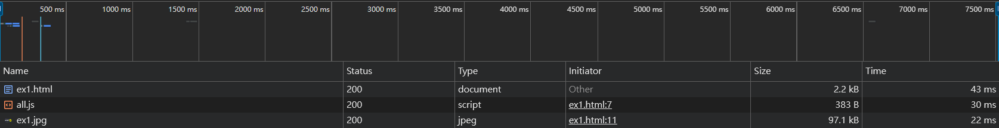
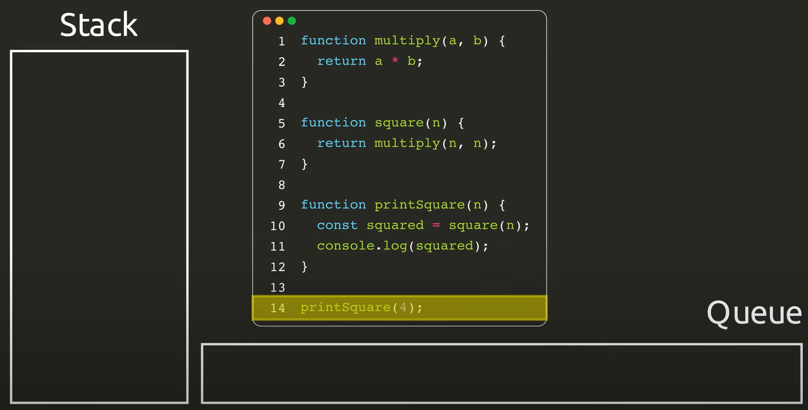

== 同步/非同步差異

=== 舉例生活化的例子

* **同步（在原地等待）**：就像你在咖啡廳點餐後，**在原地等待店員**做完咖啡，拿到咖啡後才做下一件事情。
所以同步的特性：**必須等待當前的任務完成，才做下一件事情**。

* **非同步（先回座位處理事情）**：你在咖啡廳點完餐後，**回到座位**，打開電腦處理其他事情，等到**店員叫號**的時候再去拿咖啡。
所以非同步的特性：**在等待某個任務的完成期間，可以處理其他任務**。

image::images/img1.png[同步非同步]

=== 在瀏覽器中的同步載入

* link:example/ex1.html[簡單HTML的例子(同步)]
* link:example/ex1-1.html[簡單HTML的例子(非同步)]

[source,html]
----
<!DOCTYPE html>
<html lang="en">
<head>
    <meta charset="UTF-8">
    <meta name="viewport" content="width=device-width, initial-scale=1.0">
    <link rel="icon" href="ex1.jpg" type="icon">
    <title>Example1</title>
</head>
<body>
    <h1>範例1</h1>
    <!--為了明顯差異才放這-->
    
    
</body>
</html>
----
* 這個範例想說明
  . 瀏覽器會請求整個HTML文件，並逐行解析。在解析的過程中，如果遇到圖片或CSS等外部資源時，瀏覽器會發出請求來載入這些資源，並同時繼續解析其餘的HTML。
  . 當遇到JavaScript檔案時，如果沒有使用 `async` 或 `defer` 屬性，瀏覽器會暫停解析HTML，直到JavaScript載入並執行完成，才會繼續解析剩餘的HTML。因此，當JavaScript需要執行時間較久，可能會造成阻塞(Blocking)，導致使用者感覺頁面卡住。

- link:https://developer.mozilla.org/zh-CN/docs/Glossary/Parse[參考資料1]
link:https://html.spec.whatwg.org/multipage/images.html#attributes-common-to-source-and-img-elements[參考資料2]

== Event Loop、CallBack與非同步的關係
* **JavaScript 是單執行緒**，因此想要達成非同步操作，就需要依賴執行環境提供的機制

* JavaScript 本身並沒有事件循環（Event Loop）這個機制，是由 JavaScript 的執行環境所提供的

* 當遇到非同步操作時，callback 函式在 **Event Loop 管理下**，會被丟到外面，等同步操作完成後，Event Loop 再從 Queue 中取出 callback 函式執行。

=== 以 setTimeout() 函式例子來解釋

* 一般情況下，同步的程式碼會到 Call Stack（後進先出）內逐一執行。

* 當執行 setTimeout() 函式時，setTimeout 會短暫進入 Call Stack 設定計時器，並將 callback 函式交給 Web API 進行計時。等計時時間到後，callback 函式會進入 Queue 排隊，當 Stack 內同步操作都完成且為空時，Event Loop 會將它取出來執行。

image::images//img4.png[非同步]

=== Queue 又細分為 Microtask（微任務）、Macrotask（宏任務）

* macrotask（就是 task）是指比較大型且需要等待的非同步操作。常見的 macrotask 包括：
    - 從 `
----

* 這段代碼中，使用了 fetch() 來發送 HTTP 請求到 `https://jsonplaceholder.typicode.com/posts/${postId}`，請求數據並通過 `.then(response => response.json())`` 將回應轉換為 JSON 格式的數據。

* `.then(data => { ... })` 接收轉換後的數據，用這些數據來覆蓋原本的 HTML 內容。

* `document.getElementById('content').innerHTML`更改 content 這個 
 元素的內容，將其覆蓋為新的 <h3> 和 
 元素。

=== AJAX 的實現方式

==== 最原始的方式

* **XMLHttpRequest**：
  * 需要手動處理請求的建立 (open 方法)、發送 (send 方法)、以及如何處理回應 (onload 事件)。
  
  [source, javascript]
  ----
  const xhr = new XMLHttpRequest();
  xhr.open('GET', 'https://jsonplaceholder.typicode.com/posts/1');
  xhr.onload = function() {
      if (xhr.status === 200) {
          console.log(JSON.parse(xhr.responseText));
      } else {
          console.error('Request failed.');
      }
  };
  xhr.send();
  ----

* **Fetch API**：
  * 比較現代的方式，使用 Promise 來進行非同步操作。比  `XMLHttpRequest` 更加簡潔。

  [source, javascript]
  ----
  fetch('https://jsonplaceholder.typicode.com/posts/1')
      .then(response => response.json())
      .then(data => console.log(data))
      .catch(error => console.error('Error:', error));
  ----

==== 工具與框架

* **Axios**：
  基於 **Promise** 的 HTTP 客戶端，在 `Fetch API` 的基礎上進一步封裝，提供了一些更方便的功能，例如錯誤處理、請求取消等。

  [source, javascript]
  ----
  axios.get('https://jsonplaceholder.typicode.com/posts/1')
      .then(response => console.log(response.data))
      .catch(error => console.error('Error:', error));
  ----

* **jQuery 的 $.ajax()**：
  是 jQuery 中的 AJAX 方法，早期廣泛使用，但現在主要出現在一些老項目。

  [source, javascript]
  ----
  $.ajax({
      url: 'https://jsonplaceholder.typicode.com/posts/1',
      method: 'GET',
      success: function(data) {
          console.log(data);
      },
      error: function(error) {
          console.error('Error:', error);
      }
  });
  ----

=== 總結

* Ajax是一套綜合性瀏覽器端技術，結合多種前端技術，透過非同步請求來提升使用者體驗。

|===
| 技術          | 描述

| HTML/CSS
| 定義網頁的結構和樣式，使網頁具有良好的外觀和版面

| JavaScript
| 控制頁面的動態行為，操作 DOM，實現非同步資料互動

| XMLHttpRequest 或 Fetch API
| 與伺服器進行非同步通訊，實現資料的部分更新

| JSON/XML
| 瀏覽器和伺服器之間的資料格式
|===

* 實現方式有下面幾種
|===
| 實現方式        | 說明

| XMLHttpRequest  | 最早期的 AJAX 實現方式，手動處理請求的建立、發送及回應。
| Fetch API       | 現代化的替代方案，語法簡潔，基於 Promise 進行非同步操作。
| Axios           | 基於 Promise 的 HTTP 客戶端，封裝底層請求，提供更友善的語法及更多功能（如錯誤處理、取消請求等）。
| jQuery 的 $.ajax() | 早期廣泛使用的 AJAX 方法，現在主要用於一些舊有項目中。
|===

* link:https://www.keycdn.com/support/ajax-programming[參考資料7 - What Is Ajax Programming - Explained]
* link:https://codedocs.org/what-is/ajax-programming[參考資料8 - Ajax (programming)]